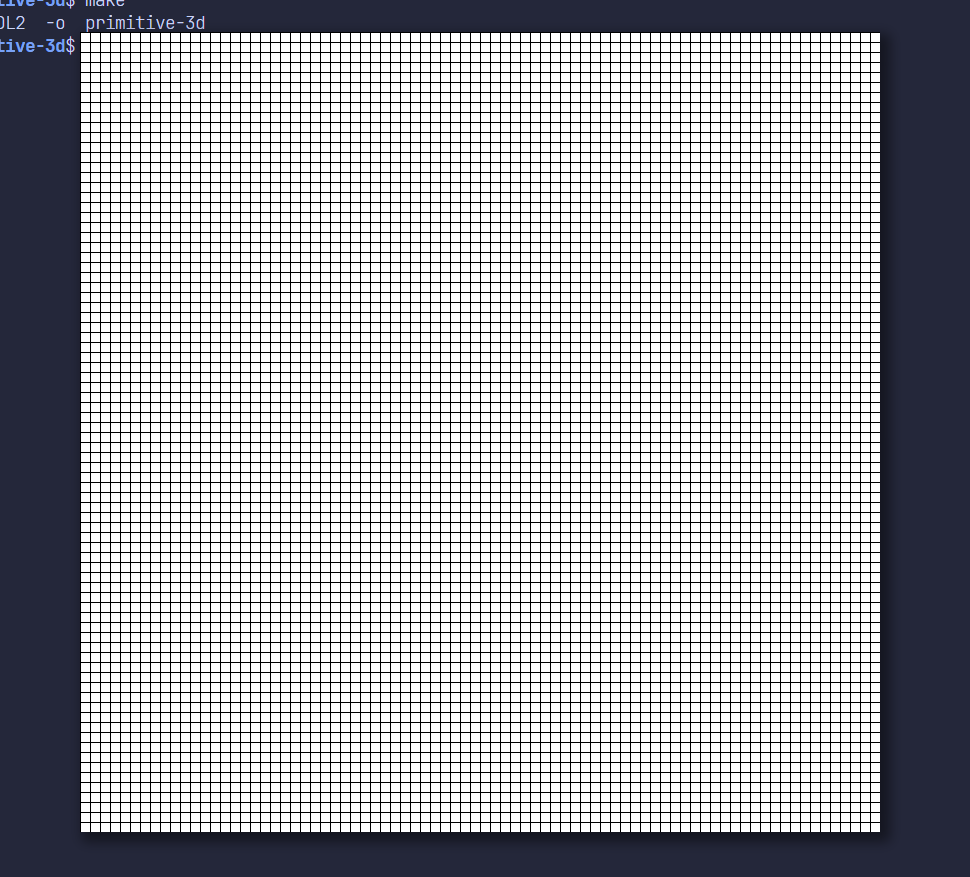
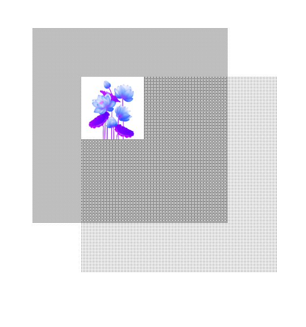
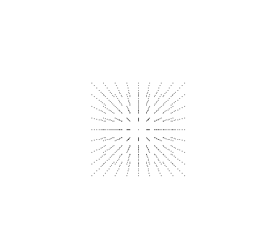
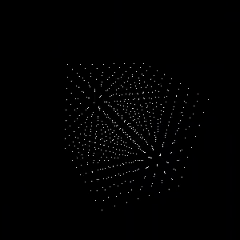

# Primitive-3d

Primitive-3D is a learning project that explores the fundamentals of 3D computer graphics without relying on modern graphics APIs like OpenGL, Vulkan, or DirectX. Instead of depending on hardware-accelerated pipelines, this project focuses on manually manipulating a color buffer at the pixel level to render shapes, grids, and even 3D-like projections.

The aim is to understand how graphics rendering works at the most basic level—starting from drawing grids and primitive shapes and slowly building toward more complex structures in 3D space.

This project is what we call as software rendered graphics - which is slower than hardware accelerated graphics but provides me and anyone following through the commits of this repo with a good understanding of how 3d graphics works - from the very root - like manipulating each and every pixel level root ( you are at the lowest point ) - this is now graphics or text is written in some of the more unconventional embedded stuff. 

Maybe we can have a website explaining all of it and the resources used after I finish this - yup will do that.

## Draw Grid:



```cpp
void draw_grid(){
    for(int i = 0 ; i < window_height; i++) {
        for(int j = 0; j < window_width ; j++) {
            if ( j % 10 == 0 || i % 10 == 0) {
                color_buffer[window_width * j + i] = 0x00000000;
            }
        }
    }
}
```

Here we are manually manipulating the color_buffer to change the color of the pixels at that particular position.


## Draw Square / Rectangle


```cpp
void drawSquare(int posx, int posy, int width, int height, uint32_t color){
    int beginx = std::max(0, posx);
    int beginy = std::max(0, posy); 

    int endx = std::min(widow_width, beginx + width);
    int endy = std::min(window_height, beginy + height);

    for(int y = beginy ; y < endy ; y++){
        for(int x = beginx; x < endx ; x++){
            color_buffer[(width * y) + x] = color;
        }
    }
}
```

## Draw a bitmap



## Points in 3d - like a 3d Square




## Spinning Cube



## Limitations:

This is a list of limitation that I encountered while implementing it and the solution or what I have though on using as a solution to it:

1. **Visibility Problem:** 

    - The current rendering is order dependent. The renderer draws objects in the exact sequence they appear in the update loop.

    - This is creates a last in win system, if a rectangle is drawn after a circle, the rectangle will appear on top even if it is to be further from the camera.

    - The color buffer only keeps track of the pixels and not distance between the objects that those pixels represent.

    Current Solution: Painter's Algorithm - (this was used in the doom engine)


<!--
| Problem | Description | Solution Approach | Status |
|---------|-------------|-------------------|--------|
|**1. Hidden Surface Problem**| Stack like rendering  
-->
## Acknowledgements:

- Pikuma 3d Computer graphics course : [https://github.com/pr0g/pikuma-3d-graphics](https://github.com/pr0g/pikuma-3d-graphics) - highly recommended
- Hoff._world video on [How to write a display driver from start to finish](https://www.youtube.com/watch?v=5cp2iPGWmUY)
- **Website for image to c conversion:** [https://notisrac.github.io/FileToCArray/](https://notisrac.github.io/FileToCArray/)
- [Collision Detection Video from VertoStudio3d](http://youtube.com/watch?v=wVhSQHKvBW4)
- The lotus bitmap was created from an image designed by **macrovector / Freepik**